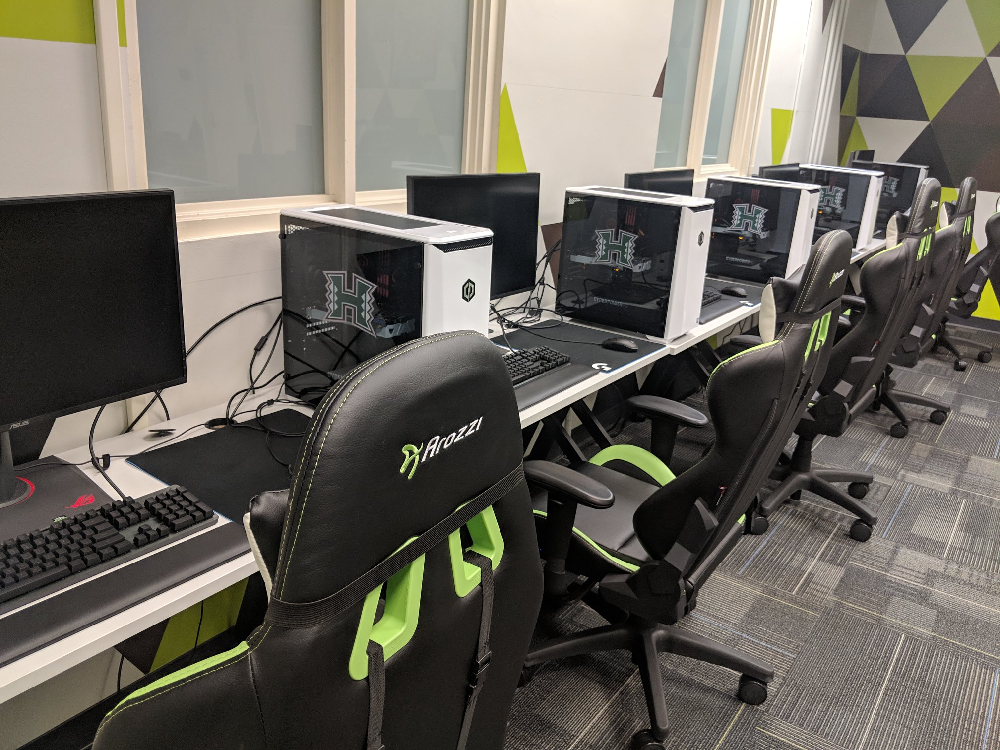
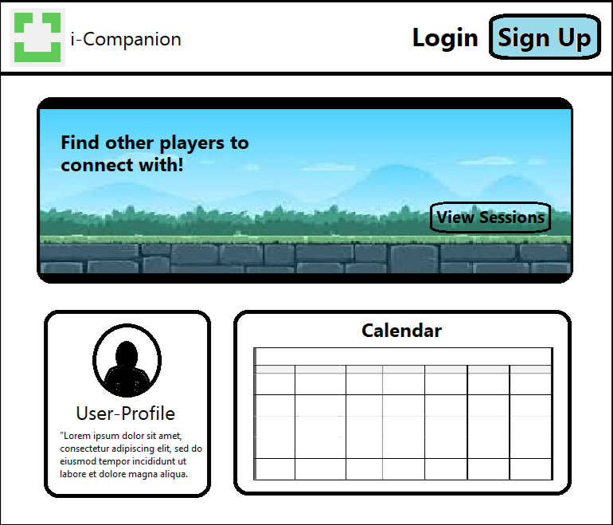
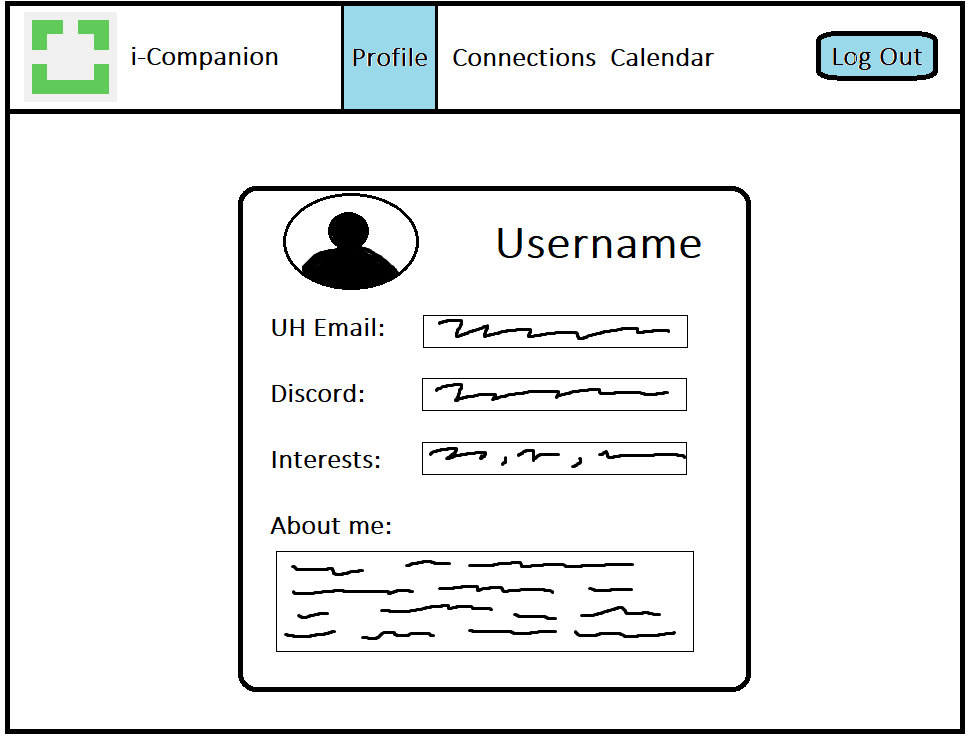
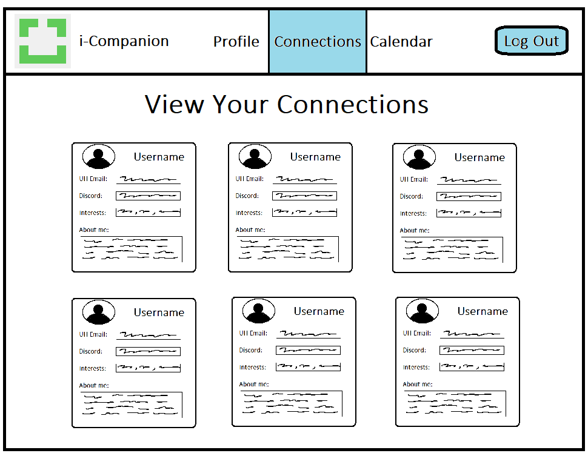
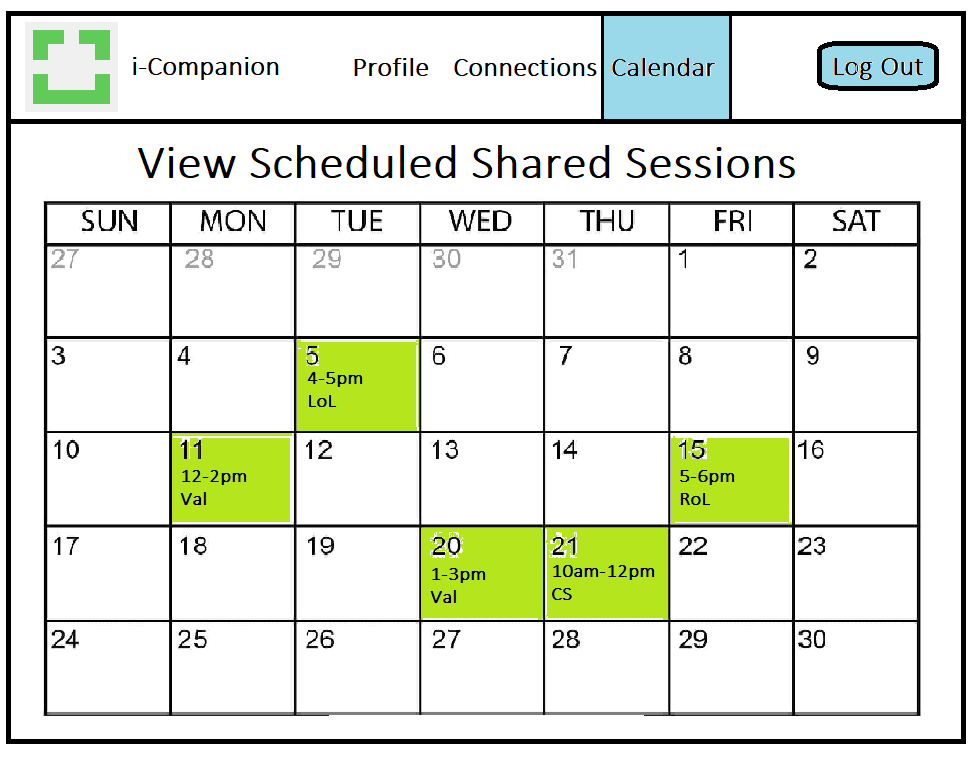

<!-- -->

## Table of Contents
- [Overview](#overview)
- [Deployment](#deployment)
- [User Guide](#user-guide)
- [Developer Guide](#developer-guide)
- [Development History](#development-history)
- [The Team](#the-team)
- [Team Contract](#team-contract)


## Overview



The iLab is a gaming lounge on the campus of UH Manoa for UH Mānoa students, faculty and staff, and is open on weekdays 10:30 a.m.–6 p.m. Members are able to to come and game, learn about esports, and meet other people who are interested in esports. It is also a great place to relax and destress with your friends as the semester progresses.

There are many students that come to the ilab, especially during the first couple weeks of school, that don't have anyone to play with as most of their usual friends may not go to UH. It may be easier to enjoy your time at the iLab lounge if you are able to make new groups, meet new friends, and learn more about the community by being a part of it.

The iCompanion web application sorts UH students using similar, interests, available times, etc and connects them with each other, allowing for the process of forming connections and making friends easier.


## Deployment

[Link](https://i-companion.vercel.app/) to running deployment of iCompanion on Vercel.


## User Guide

### Landing Page

The landing page allows the user to sign-in or create their account using their UH email as their username. It also displays and example of the other pages once the user signs in.

Idea:



Progress:


### Profile 

Once signed in, the user can add or edit their profile details. These include their username, contact details such as discord or in-game usernames, and a short description of their interests / what they like to play.

Idea:



Progress:


### Connections

Using their interests, the application can suggest new users to connect and interact with within iLabs.

Idea:



Progress:


### Calendar

A calendar view can also be shown of all of the scheduled gaming sessions in iLabs that were made public by the organizer.

Idea:



Progress:


## Developer Guide

### Installation

1. Go to the [iCompanion repo](https://github.com/i-companion/iCompanion).

2. Click the "Use this template" button to create your own repository initialized with a copy of iCompanion.

3. `cd` into iCompanion's `app` directory and install libraries with:

```
$ npm install
```

4. Run the system with:

```
$ npm run dev
```

5. If everything works, iCompanion will appear at [http://localhost:3000](http://localhost:3000).

### ESLint

iCompanion includes a ESLint file to adhere to coding standards. This allows application's code to be more consistent and organized.

ESLint can be invoked with the following command:

```
$ npm run lint
```

ESLint should run without generating any errors.


## Development History

### Milestone 1 (M1)

The main goal of M1 was to deploy the system to Vercel and start implementing code. This milestone was the beginning of the project, therefore this milestone was primarily for setting up the environment.

[Link](https://github.com/orgs/i-companion/projects/1/views/1) to M1

### Milestone 2 (M2)
<ol>
   <li>
Develop the functionality and layout of the web application with larger focus on its function. This includes the navbar components and links, profile card components, and calendar components.
   </li>
<li>
Pages that are functional:
   <ul>
<li>Landing page and its subsequent links</li>
<li>Sign-in / Register pages
<li>Create / Edit user profile page</li>
<li>Dislpay calendar and events page</li>
   </ul>
</li>
<li>Pages that will read &/or write to the database, including but not limited to the Sign-in / Register page and Create / Edit user profile page</li>
<li>Continue updating the development progess with current screenshots</li>
</ol>

[Link](https://github.com/orgs/i-companion/projects/3/views/1) to M2.

### Milestone 3 (M3)

The main goal of M3 was to ...

[Link](https://github.com/orgs/i-companion/projects/4) to M3.


## The Team 

### Julian Bejar
Junior computer science student at UH manoa pursuing the Data Science track

### Abigail Lorber
Junior at UH Manoa, currently seeking a B.S. in Computer Science.

### Kai Sutton
Information and Computer Science student at UH Manoa

### Micah Tossey


### Phoebe Chang


## Team Contract

[Link to Team Contract](https://docs.google.com/document/d/1fk9-8-RfUI3wKC04T7Q8dusIydw-vxO_euXqXWyy_ng/edit?usp=sharing) (will open in Google Docs).
